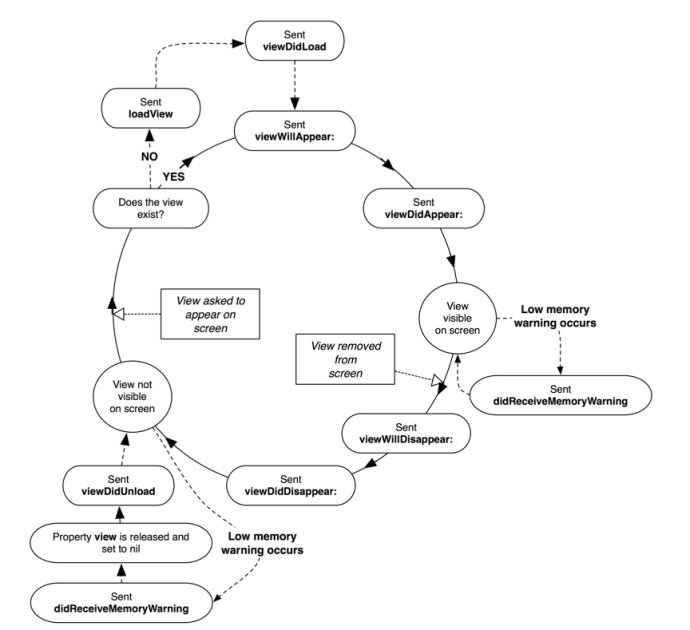

# ViewController Lifecycle



### VC 1 <----> VC 2

```sh
CALL-------------------> VC1

VC1 viewDidLoad Called
VC1 viewWillAppear Called
VC1 viewDidAppear Called
 
VC1 ------------------->CALL-------------------> VC2

                                        VC2 viewDidLoad Called
VC1 viewWillDisappear Called
                                        VC2 viewWillAppear Called
                                        VC2 viewDidAppear Called
VC1 viewDidDisappear Called

VC1 <-------------------CALL<------------------- VC2

                                        VC2 viewWillDisappear Called
VC1 viewWillAppear Called
VC1 viewDidAppear Called
                                        VC2 viewDidDisappear Called
```